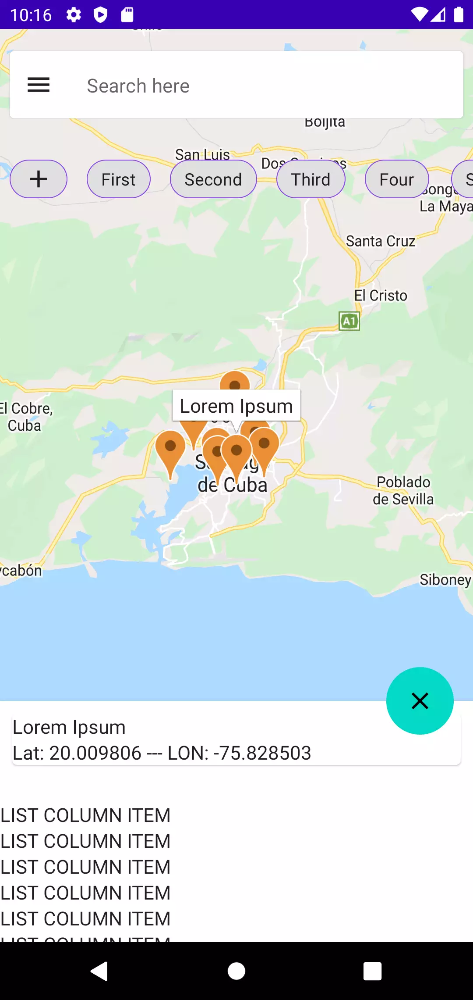

# GMap
  This Jetpack Compose component was born out of the need to implement a map in some of the projects I'm working on for the Inmersoft Group.
  The idea was to generate a generic map component that could be reused in various projects.

  Jetpack Compose and Google Maps are used.

  A data model is used to pass by parameters the information that the component needs to show the markers on the map, filtering and searching are also included... in addition to using a BottomSheet in which any composable passed by parameters will be rendered .


## Dependencies

1. Add it in your root build.gradle at the end of repositories:

```gradle
	allprojects {
		repositories {
			...
			maven { url 'https://jitpack.io' }
		}
	}
  ```
2. Add the dependency

```gradle
	dependencies {
	        implementation 'com.github.orlandev:GMap:x.y.z'
	}
  ```


## Required data models

Data model needed to display the necessary information on the map. 
> A list of MapPlaceInfo must be passed to the component

```kotlin
data class MapPlaceInfo(
      val uuid: String,
      val location: MapPoint,
      val title: String = "",
      val icon: Bitmap? = null,
      val groupBy: GroupBy? = null,
    )
  
 ```
 
 The GroupBy data model is a list that will be displayed as a quick access top filter that will contain an icon and a text within a material chip component
 
 ```kotlin
 data class GroupBy(
    val filter: String, //Criteria to filter
    val icon: Bitmap? = null, //Icon to show referring to the filter, example restaurants
)
 ```
 
 Data model for the points on the map.
 > Internally they are converted into valid points for Google Map
 
 ```kotlin
 data class MapPoint(
    val latitude: Double,
    val longitude: Double,
)
 ```
 
 # Sample
 
 1. Generate the information for the map points
   ```kotlin
    val listOfFilters = listOf(
                        "First",
                        "Second",
                        "Third",
                        "Four",
                        "Six",
                        "Seven",
                        "Home",
                        "Other"
                    )
   
   val listOfMapPoints = listOf<MapPlaceInfo>(
                        MapPlaceInfo(
                            uuid = UUID.randomUUID().toString(),
                            location = MapPoint(20.009806, -75.828503),
                            title = "Lorem Ipsum",
                            groupBy = GroupBy(filter = listOfFilters[Random().nextInt(listOfFilters.size)]),
                        ),
                        MapPlaceInfo(
                            uuid = UUID.randomUUID().toString(),
                            location = MapPoint(20.013677, -75.812710),
                            title = "Real Home",
                            groupBy = GroupBy(filter = listOfFilters[Random().nextInt(listOfFilters.size)]),
                        ),
                        MapPlaceInfo(
                            uuid = UUID.randomUUID().toString(),
                            location = MapPoint(20.009161, -75.839146),
                            title = "Pretty Space",
                            groupBy = GroupBy(filter = listOfFilters[Random().nextInt(listOfFilters.size)]),
                        ),
                        MapPlaceInfo(
                            uuid = UUID.randomUUID().toString(),
                            location = MapPoint(20.043998, -75.829533),
                            title = "Other place",
                            groupBy = GroupBy(filter = listOfFilters[Random().nextInt(listOfFilters.size)]),
                        ),
                        MapPlaceInfo(
                            uuid = UUID.randomUUID().toString(),
                            location = MapPoint(20.027870, -75.852879),
                            title = "New Space",
                            groupBy = GroupBy(filter = listOfFilters[Random().nextInt(listOfFilters.size)]),
                        ),
                        
   ```
   
2. Create a state to know which is the place that is currently selected by the user
```kotlin
val currentPlaceInfo = remember { mutableStateOf<MapPlaceInfo?>(null) } 
```

3. Add the composable that will display the information when the user selects a marker on the map
```kotlin
          MapScreen(
             listOfMapPoints = listOfMapPoints,
             listOfFilters = listOfFilters,
              onMapPlaceInfoSelected = {
                       currentPlaceInfo.value = it
             },
         ) {
              BoxWithConstraints {
                  LazyColumn(modifier = Modifier.fillMaxSize()) {
                      currentPlaceInfo.value?.let { mapPlaceInfo ->
                             item {
                                Card(
                                   modifier = Modifier
                                        .fillMaxWidth()
                                        .padding(10.dp)
                                 ) {
                                       Column(modifier = Modifier.fillMaxSize()) {
                                           Text(text = mapPlaceInfo.title)
                                           Text(text = mapPlaceInfo.location.toString())
                                       }
                                   }

                             }
                
                             item {
                                      Spacer(modifier = Modifier.height(20.dp))
                             }
                             
                             items(500) {
                                  Text(text = "LIST COLUMN ITEM")
                             }
                          }
                    }
                }
            }
```

 |  | 
   
   
   
   
   
   
   
   
   
   
   
   
   
   
   
   
   
   
   
 
 
 
 
